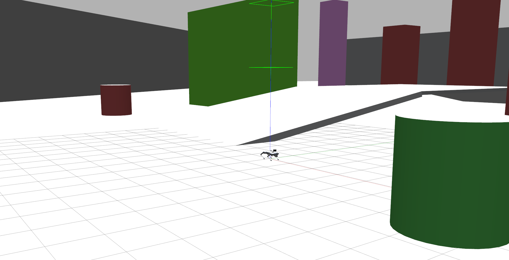
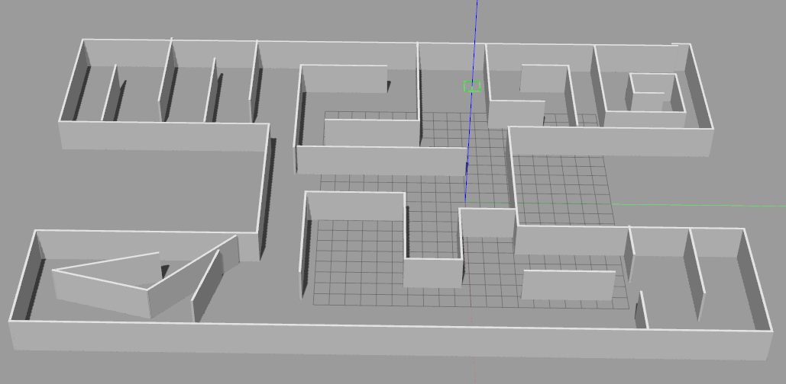
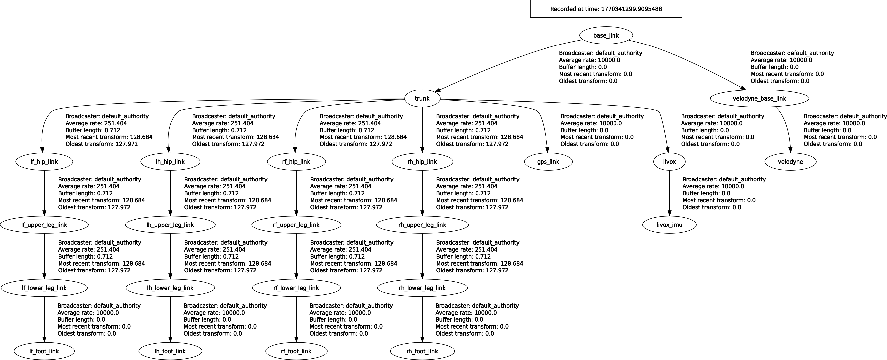

# Gazebo Go2(W) Quadbot Simulation
This repository contains the Gazebo simulation environment and URDF description for the Go2 Quadbot robot, equipped with a Livox Mid-360 LiDAR sensor and GPS module.

Forked from [gazebo_go2_simulation](https://github.com/dfl-rlab/gz_quadbot.git)

Livox lidar simulation is based on: 
- [official_gazebo9_ros1](https://github.com/Livox-SDK/livox_laser_simulation)
- [gazebo11_ros2_version](https://github.com/inkccc/mid360_simulation)

Running environment refer to: [gazebo_env_dockerfile](https://github.com/dfl-rlab/dddmr_navigation/blob/main/dddmr_docker/docker_file/Dockerfile_x64_gazebo)

# Additional Features
- **add gps sensor**: before running, set latitude_deg / longitude_deg / elevation / heading_deg in xx.world to set the gps origin
- **add livox lidar**: set lidar mounting pose in [xacro](robots/descriptions/go2_description/xacro/robot_VLP.xacro). If you don't need livox or velodyne, comment out the corresponding lines.
- **add more worlds**: see [worlds](robots/configs/go2_config/worlds)

| World | Scene Type | Overview |
|-------|------|----------|
|slope_with_pillar_2 | outdoor, closure, multi floor, no stairs |  |
|bigHHH | indoor, closure, multi room, no stairs |  |
|building | indoor, closure, multi floor, stairs | not ready |

Launch with:
```bash
# Go2 run
ros2 launch go2_config go2_lidar_gps.launch.py
# Go2w run
ros2 launch go2w_config go2w_lidar_gps.launch.py
```

To control the robot from keyboard, new terminal run:
```bash
ros2 run teleop_twist_keyboard teleop_twist_keyboard
```


# Topics List
| Topic | Type |
|-------|------|
| /base_to_footprint_pose | geometry_msgs/msg/PoseWithCovarianceStamped |
| /body_pose | geometry_msgs/msg/Pose |
| /clock | rosgraph_msgs/msg/Clock |
| /cmd_vel | geometry_msgs/msg/Twist |
| /dynamic_joint_states | control_msgs/msg/DynamicJointState |
| /foot | visualization_msgs/msg/MarkerArray |
| /foot_contacts | champ_msgs/msg/ContactsStamped |
| /gps/data | sensor_msgs/msg/NavSatFix |
| /gps_plugin/vel | geometry_msgs/msg/Vector3Stamped |
| /joint_group_effort_controller/controller_state | control_msgs/msg/JointTrajectoryControllerState |
| /joint_group_effort_controller/joint_trajectory | trajectory_msgs/msg/JointTrajectory |
| /joint_group_effort_controller/state | control_msgs/msg/JointTrajectoryControllerState |
| /joint_group_effort_controller/transition_event | lifecycle_msgs/msg/TransitionEvent |
| /joint_states | sensor_msgs/msg/JointState |
| /joint_states_controller/transition_event | lifecycle_msgs/msg/TransitionEvent |
| /livox/imu | sensor_msgs/msg/Imu |
| /livox/lidar | sensor_msgs/msg/PointCloud2 |
| /odom/raw | nav_msgs/msg/Odometry |
| /parameter_events | rcl_interfaces/msg/ParameterEvent |
| /performance_metrics | gazebo_msgs/msg/PerformanceMetrics |
| /robot_description | std_msgs/msg/String |
| /rosout | rcl_interfaces/msg/Log |
| /tf | tf2_msgs/msg/TFMessage |
| /tf_static | tf2_msgs/msg/TFMessage |
| /velodyne_points | sensor_msgs/msg/PointCloud2 |

The simulation already publishes the static tf within this robot and its sensor mounted on it:
